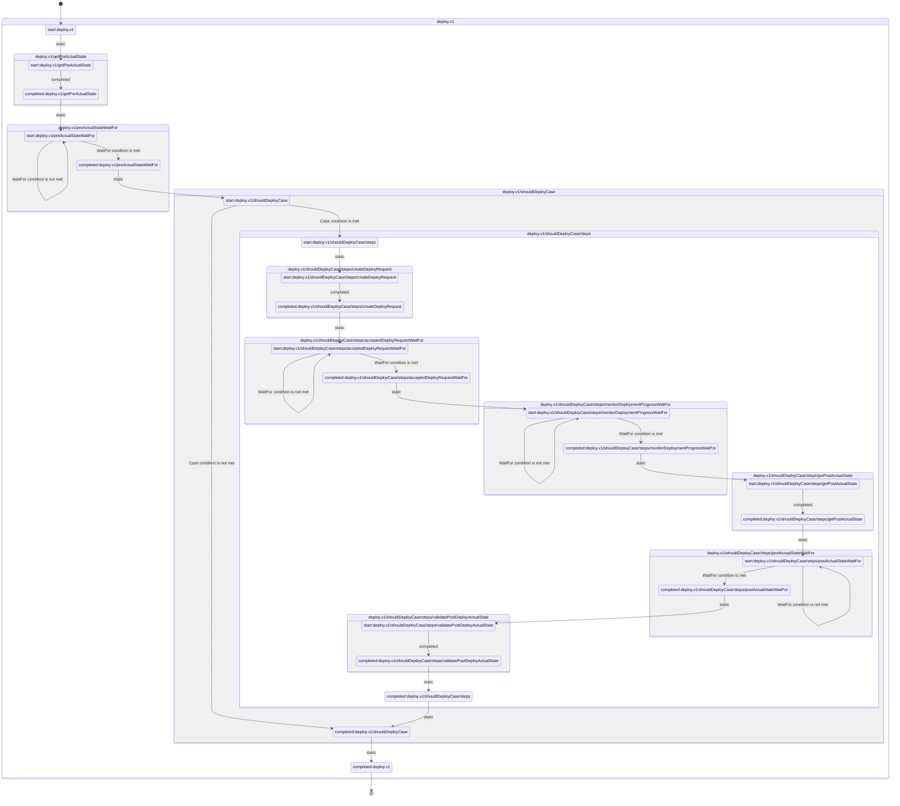

# go-stepflow

**go-stepflow** is a Go library for building and executing durable long-running processes.
It was designed originally to be used in conjunction with kubebuilder/controller-runtime to build Kubernetes controllers, but it has no dependencies to Kubernetes.

## Example
A continuous deployment pipeline step with the following structure may be implemented using the code snippets below.
 * Trigger async actual state collection for a given application in a given environment.
 * Wait for the async operation to complete
 * Compare the desired state with the actual state. If change is required:
   - Create an automated git pull request to the GitOps repository
   - Wait for the automated pull request to be merged automatically.
   - Wait for the GitOps agent(ie. ArgoCD) to successfully uptake the new change. Report back any deployment related events(ie. rolling upgrade details).
   - Trigger post deployment async actual state collections.
   - Wait for the async operation to complete.
   - Validate the post deployment actual state.


### Workflow definition

```go
package demo

import (
	"github.com/cbalan/go-stepflow"
)

func DeployStepFlow() (stepflow.StepFlow, error) {
	return stepflow.NewStepFlow(stepflow.Steps().
		WithName("deploy.v1").
		Do("getPreActualState", getActualState("preDeploy")).
		WaitFor("preActualState", isGetActualStateCompleted("preDeploy")).
		Case("shouldDeploy", shouldDeploy, stepflow.Steps().
			Do("createDeployRequest", createGitOpsVersionBump).
			WaitFor("acceptedDeployRequest", isGitOpsVersionBumpAccepted).
			WaitFor("monitorDeploymentProgress", isVersionLiveSuccessfully).
			Do("getPostActualState", getActualState("postDeploy")).
			WaitFor("postActualState", isGetActualStateCompleted("postDeploy")).
			Do("validatePostDeployActualState", validatePostActuatState)))
}

...

func createGitOpsVersionBump(ctx context.Context) error {
  ... 

  err := gitClient.CreatePullRequest(...)
  ...
  
  return nil
}
```

### Workflow initialization in the main function
```go
  flow, err := DeployStepFlow()
```


### Workflow execution loop
```go
// Prepare execution context
applyCtx, err := setFlowApplyContext(ctx)

// Load previous state
previousState, err := getState(ctx)

// Execute workflow iteration 
newState, err := flow.Apply(applyCtx, previousState)

// Save new state
err := saveState(newState)
```

### Underlying stepflow state machine
